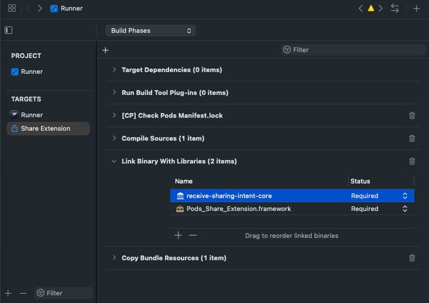

# receive_sharing_intent
[](https://pub.dev/packages/receive_sharing_intent)

A Flutter plugin that enables flutter apps to receive sharing photos, videos, text, urls or any other file types from another app.

Also, supports iOS Share extension and launching the host app automatically.
Check the provided [example](./example/lib/main.dart) for more info.


|             | Android                 | iOS               |
|-------------|-------------------------|-------------------|
| **Support** | SDK 19+ (Kotlin 1.9.22) | 12.0+ (Swift 5.0) |


# Usage

To use this plugin, add `receive_sharing_intent` as a [dependency in your pubspec.yaml file](https://flutter.io/platform-plugins/). For example:

```yaml
dependencies:
  receive_sharing_intent: ^latest
```

## Android

Add the following filters to your [android/app/src/main/AndroidManifest.xml](./example/android/app/src/main/AndroidManifest.xml):

```xml
<manifest xmlns:android="http://schemas.android.com/apk/res/android"
.....
 <uses-permission android:name="android.permission.READ_EXTERNAL_STORAGE"/>

  <application
        android:name="io.flutter.app.FlutterApplication"
        ...
        >
<!--Set activity launchMode to singleTask, if you want to prevent creating new activity instance everytime there is a new intent.-->
    <activity
            android:name=".MainActivity"
            android:launchMode="singleTask"
            android:theme="@style/LaunchTheme"
            android:configChanges="orientation|keyboardHidden|keyboard|screenSize|locale|layoutDirection|fontScale|screenLayout|density|uiMode"
            android:hardwareAccelerated="true"
            android:windowSoftInputMode="adjustResize">

            <!--TODO:  Add this filter, if you want support opening urls into your app-->
            <intent-filter>
               <action android:name="android.intent.action.VIEW" />
               <category android:name="android.intent.category.DEFAULT" />
               <category android:name="android.intent.category.BROWSABLE" />
               <data
                   android:scheme="https"
                   android:host="example.com"
                   android:pathPrefix="/invite"/>
            </intent-filter>

            <!--TODO:  Add this filter, if you want support opening files into your app-->
            <intent-filter>
              <action android:name="android.intent.action.VIEW" />
              <category android:name="android.intent.category.DEFAULT" />
              <data
                   android:mimeType="*/*"
                   android:scheme="content" />
            </intent-filter>

             <!--TODO: Add this filter, if you want to support sharing text into your app-->
            <intent-filter>
               <action android:name="android.intent.action.SEND" />
               <category android:name="android.intent.category.DEFAULT" />
               <data android:mimeType="text/*" />
            </intent-filter>

            <!--TODO: Add this filter, if you want to support sharing images into your app-->
            <intent-filter>
                <action android:name="android.intent.action.SEND" />
                <category android:name="android.intent.category.DEFAULT" />
                <data android:mimeType="image/*" />
            </intent-filter>

            <intent-filter>
                <action android:name="android.intent.action.SEND_MULTIPLE" />
                <category android:name="android.intent.category.DEFAULT" />
                <data android:mimeType="image/*" />
            </intent-filter>

             <!--TODO: Add this filter, if you want to support sharing videos into your app-->
            <intent-filter>
                <action android:name="android.intent.action.SEND" />
                <category android:name="android.intent.category.DEFAULT" />
                <data android:mimeType="video/*" />
            </intent-filter>
            <intent-filter>
                <action android:name="android.intent.action.SEND_MULTIPLE" />
                <category android:name="android.intent.category.DEFAULT" />
                <data android:mimeType="video/*" />
            </intent-filter>

            <!--TODO: Add this filter, if you want to support sharing any type of files-->
            <intent-filter>
                <action android:name="android.intent.action.SEND" />
                <category android:name="android.intent.category.DEFAULT" />
                <data android:mimeType="*/*" />
            </intent-filter>
            <intent-filter>
                <action android:name="android.intent.action.SEND_MULTIPLE" />
                <category android:name="android.intent.category.DEFAULT" />
                <data android:mimeType="*/*" />
            </intent-filter>
      </activity>

  </application>
</manifest>
....
```

## iOS

#### 1. Create Share Extension

- Using Xcode, go to File/New/Target and Choose "Share Extension".
- Give it a name, i.e., "Share Extension".

Make sure the deployment target for Runner.app and the share extension is the same.

#### 2. Replace your [ios/Share Extension/Info.plist](./example/ios/Share%20Extension/Info.plist) with the following:

```xml
<?xml version="1.0" encoding="UTF-8"?>
<!DOCTYPE plist PUBLIC "-//Apple//DTD PLIST 1.0//EN" "http://www.apple.com/DTDs/PropertyList-1.0.dtd">
<plist version="1.0">
  <dict>
    <key>AppGroupId</key>
    <string>$(CUSTOM_GROUP_ID)</string>
	<key>CFBundleVersion</key>
	<string>$(FLUTTER_BUILD_NUMBER)</string>
	<key>NSExtension</key>
	<dict>
		<key>NSExtensionAttributes</key>
        <dict>
            <key>PHSupportedMediaTypes</key>
               <array>
                    <!--TODO: Add this flag, if you want to support sharing video into your app-->
                   <string>Video</string>
                   <!--TODO: Add this flag, if you want to support sharing images into your app-->
                   <string>Image</string>
               </array>
            <key>NSExtensionActivationRule</key>
            <dict>
                <!--TODO: Add this flag, if you want to support sharing text into your app-->
                <key>NSExtensionActivationSupportsText</key>
                <true/>
                <!--TODO: Add this tag, if you want to support sharing urls into your app-->
            	<key>NSExtensionActivationSupportsWebURLWithMaxCount</key>
            	<integer>1</integer>
            	<!--TODO: Add this flag, if you want to support sharing images into your app-->
                <key>NSExtensionActivationSupportsImageWithMaxCount</key>
                <integer>100</integer>
                <!--TODO: Add this flag, if you want to support sharing video into your app-->
                <key>NSExtensionActivationSupportsMovieWithMaxCount</key>
                <integer>100</integer>
                <!--TODO: Add this flag, if you want to support sharing other files into your app-->
                <!--Change the integer to however many files you want to be able to share at a time-->
				<key>NSExtensionActivationSupportsFileWithMaxCount</key>
				<integer>1</integer>
            </dict>
        </dict>
		<key>NSExtensionMainStoryboard</key>
		<string>MainInterface</string>
		<key>NSExtensionPointIdentifier</key>
		<string>com.apple.share-services</string>
	</dict>
  </dict>
</plist>
```
#### 3. Add the following to your [ios/Runner/Info.plist](./example/ios/Runner/Info.plist):

```xml
...
<key>AppGroupId</key>
<string>$(CUSTOM_GROUP_ID)</string>
<key>CFBundleURLTypes</key>
	<array>
		<dict>
			<key>CFBundleTypeRole</key>
			<string>Editor</string>
			<key>CFBundleURLSchemes</key>
			<array>
				<string>ShareMedia-$(PRODUCT_BUNDLE_IDENTIFIER)</string>
			</array>
		</dict>
	</array>

<key>NSPhotoLibraryUsageDescription</key>
<string>To upload photos, please allow permission to access your photo library.</string>
...
```

#### 4. Add the following to your [ios/Runner/Runner.entitlements](./example/ios/Runner/Runner.entitlements):


```xml
....
    <!--TODO:  Add this tag, if you want support opening urls into your app-->
    <key>com.apple.developer.associated-domains</key>
    <array>
        <string>applinks:example.com</string>
    </array>
....
```


#### 5. Add the following to your [ios/Podfile](./example/ios/Podfile) (Skip if using SPM):
```ruby
...
target 'Runner' do
  use_frameworks!
  use_modular_headers!

  flutter_install_all_ios_pods File.dirname(File.realpath(__FILE__))

  # Share Extension is name of Extension which you created which is in this case 'Share Extension'
  target 'Share Extension' do
    inherit! :search_paths
  end
end
...
```

#### 6. Add Runner and Share Extension in the same group

* Go to `Signing & Capabilities` tab and add App Groups capability in **BOTH** Targets: `Runner` and `Share Extension` 
* Add a new container with the name of your choice. For example `group.MyContainer` in the example project its `group.com.kasem.ShareExtention`
* Add User-defined(`Build Settings -> +`) string `CUSTOM_GROUP_ID` in **BOTH** Targets: `Runner` and `Share Extension` and set value to group id created above. You can use different group ids depends on your flavor schemes

#### 7. Go to Build Phases of your Runner target and move `Embed Foundation Extension` to the top of `Thin Binary`. 


#### 8. Make your `ShareViewController`  [ios/Share Extension/ShareViewController.swift](./example/ios/Share%20Extension/ShareViewController.swift) inherit from `RSIShareViewController`:


```swift
import receive_sharing_intent_core

class ShareViewController: RSIShareViewController {
      
    // Use this method to return false if you don't want to redirect to host app automatically.
    // Default is true
    override func shouldAutoRedirect() -> Bool {
        return false
    }
    
}
```

#### 9. SPM only : Add `receive-sharing-intent-core` to Share Extension linked libraries

Go to Xcode, Share Extension target, and add `receive-sharing-intent-core` to `Link Binary With Libraries`.


NOTE: Xcode 26.5 does not provide an option to add individual libraries to the `Link Binary With Libraries` list as Flutter dependencies get added indirectly via `FlutterGeneratedPluginSwiftPackage` library in the Runner target. As a workaround, we would have to hack the `project.pbxproj`.

##### Method 1:
1. Save/Commit your existing `project.pbxproj` file as we are about to hack it.
2. Open `project.pbxproj` in your code editor:
   * Near the very top section of the file, under the `/* Begin PBXBuildFile section */` section, look for the `Pods_Share_Extension.framework` line, similar to this: `09D218251211A699B4AA483B /* Pods_Share_Extension.framework in Frameworks */ = {isa = PBXBuildFile; fileRef = 9BF4A0BD33E6A264276A1571 /* Pods_Share_Extension.framework */; };`. Note that the `09D218251211A699B4AA483B` UUID will be different on your file.
   * Add `ABB2BA8E2FC3D9B2006A33F4 /* receive-sharing-intent-core in Frameworks */ = {isa = PBXBuildFile; productRef = ABB2BA8D2FC3D9B2006A33F4 /* receive-sharing-intent-core */; };` immediately after the `Pods_Share_Extension.framework` line.
   * Look for the `09D218251211A699B4AA483B` UUID under `/* Begin PBXFrameworksBuildPhase section */` section. Add `ABB2BA8E2FC3D9B2006A33F4 /* receive-sharing-intent-core in Frameworks */,` immediately after the `09D218251211A699B4AA483B /* Pods_Share_Extension.framework in Frameworks */,` line, within the same `files` list.
   * Look for the `/* Begin XCSwiftPackageProductDependency section */` section. Add `ABB2BA8D2FC3D9B2006A33F4 /* receive-sharing-intent-core */ = { isa = XCSwiftPackageProductDependency; productName = "receive-sharing-intent-core"; };`. See below example.

`/* Begin PBXFrameworksBuildPhase section */` section should look something like this:
```
/* Begin PBXFrameworksBuildPhase section */
		97C146EB1CF9000F007C117D /* Frameworks */ = {
			isa = PBXFrameworksBuildPhase;
			buildActionMask = 2147483647;
			files = (
				78A318202AECB46A00862997 /* FlutterGeneratedPluginSwiftPackage in Frameworks */,
				605756DC43B9873876970C7A /* Pods_Runner.framework in Frameworks */,
			);
			runOnlyForDeploymentPostprocessing = 0;
		};
		AB53D6682EC9E8D3000521E4 /* Frameworks */ = {
			isa = PBXFrameworksBuildPhase;
			buildActionMask = 2147483647;
			files = (
				ABB2BA8E2FC3D9B2006A33F4 /* receive-sharing-intent-core in Frameworks */,
				09D218251211A699B4AA483B /* Pods_Share_Extension.framework in Frameworks */,
			);
			runOnlyForDeploymentPostprocessing = 0;
		};
/* End PBXFrameworksBuildPhase section */
```

`/* Begin XCSwiftPackageProductDependency section */` section should look something like this:
```
/* Begin XCSwiftPackageProductDependency section */
		78A3181F2AECB46A00862997 /* FlutterGeneratedPluginSwiftPackage */ = {
			isa = XCSwiftPackageProductDependency;
			productName = FlutterGeneratedPluginSwiftPackage;
		};
		ABB2BA8D2FC3D9B2006A33F4 /* receive-sharing-intent-core */ = {
			isa = XCSwiftPackageProductDependency;
			productName = "receive-sharing-intent-core";
		};
/* End XCSwiftPackageProductDependency section */
```


##### Method 2:
1. Save/Commit your existing `project.pbxproj` file as we are about to hack it.
2. Clone this repository to your local drive.
3. In Xcode, go to Share Extension target -> `Link Binary With Libraries`. Click on the "Add items" plus icon -> "Add Other..." -> "Add Package Dependency..." -> "Add Local...". Select `receive_sharing_intent/ios/receive_sharing_intent` directory. Xcode will throw a warning about duplicated library. Ignore the warning and select "Add anyway". Select `receive-sharing-intent-core` to add to Share Extension only.
4. Open `project.pbxproj` in your code editor, delete all sections that contain `"../../receive_sharing_intent/ios/receive_sharing_intent"`, such as
```
`ABB2BA8C2FC3D9B2006A33F4 /* XCLocalSwiftPackageReference "../../receive_sharing_intent/ios/receive_sharing_intent" */,`
```
and 
```
ABB2BA8C2FC3D9B2006A33F4 /* XCLocalSwiftPackageReference "../../receive_sharing_intent/ios/receive_sharing_intent" */ = {
			isa = XCLocalSwiftPackageReference;
			relativePath = ../../receive_sharing_intent/ios/receive_sharing_intent;
		};
```


#### Compiling issues and their fixes

* Error: No such module 'receive_sharing_intent'
  * Fix: Go to Build Phases of your Runner target and move `Embed Foundation Extension` to the top of `Thin Binary`.
  
* Error: App does not build after adding Share Extension?
  * Fix: Check Build Settings of your share extension and remove everything that tries to import Cocoapods from your main project. i.e. remove everything under `Linking/Other Linker Flags` 

* You might need to disable bitcode for the extension target

* Error: Invalid Bundle. The bundle at 'Runner.app/Plugins/Sharing Extension.appex' contains disallowed file 'Frameworks'
    * Fix: https://stackoverflow.com/a/25789145/2061365


## Full Example

[main.dart](./example/lib/main.dart)

```dart
import 'package:flutter/material.dart';
import 'dart:async';

import 'package:receive_sharing_intent/receive_sharing_intent.dart';

void main() => runApp(MyApp());

class MyApp extends StatefulWidget {
  @override
  _MyAppState createState() => _MyAppState();
}

class _MyAppState extends State<MyApp> {
  late StreamSubscription _intentSub;
  final _sharedFiles = <SharedMediaFile>[];

  @override
  void initState() {
    super.initState();

    // Listen to media sharing coming from outside the app while the app is in the memory.
    _intentSub = ReceiveSharingIntent.instance.getMediaStream().listen((value) {
      setState(() {
        _sharedFiles.clear();
        _sharedFiles.addAll(value);

        print(_sharedFiles.map((f) => f.toMap()));
      });
    }, onError: (err) {
      print("getIntentDataStream error: $err");
    });

    // Get the media sharing coming from outside the app while the app is closed.
    ReceiveSharingIntent.instance.getInitialMedia().then((value) {
      setState(() {
        _sharedFiles.clear();
        _sharedFiles.addAll(value);
        print(_sharedFiles.map((f) => f.toMap()));

        // Tell the library that we are done processing the intent.
        ReceiveSharingIntent.instance.reset();
      });
    });
  }

  @override
  void dispose() {
    _intentSub.cancel();
    super.dispose();
  }

  @override
  Widget build(BuildContext context) {
    const textStyleBold = const TextStyle(fontWeight: FontWeight.bold);
    return MaterialApp(
      home: Scaffold(
        appBar: AppBar(
          title: const Text('Plugin example app'),
        ),
        body: Center(
          child: Column(
            children: <Widget>[
              Text("Shared files:", style: textStyleBold),
              Text(_sharedFiles
                      .map((f) => f.toMap())
                      .join(",\n****************\n")),
            ],
          ),
        ),
      ),
    );
  }
}
```

